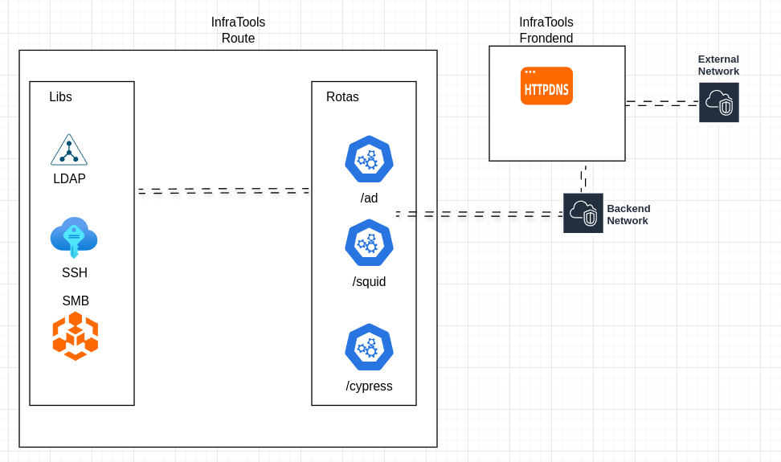

# Infrastructure Integration Tool

A tool designed for infrastructure management, providing support for various libraries and protocols, such as LDAP, SSH, SMB, and more. This tool aims to simplify and automate tasks in infrastructure environments by integrating with essential systems and services.

## Features

- **LDAP Integration**: Connect and manage directory services.
- **SSH**: Automate secure remote command execution and file transfers.
- **SMB**: Access and manage shared resources.
- **XML Parsing**: Read and manipulate XML files for configuration and data exchange.
- **Extensible Design**: Add additional protocols or features as needed.




## Requirements

- Python
- Required Python libraries (see `requirements.txt`)

## Installation

1. Clone the repository:
   ```bash
   git clone https://github.com/yourusername/infrastructure-tool.git
   cd infrastructure-tool
   ```

2. Install dependencies:
   ```bash
   pip install -r requirements.txt
   ```
NOT IMPLEMENTED YET =D

## Contributing

Contributions are welcome! Please follow these steps:

1. Fork the repository.
2. Create a new branch:
   ```bash
   git checkout -b feature-name
   ```
3. Make your changes and commit them:
   ```bash
   git commit -m "Add feature-name"
   ```
4. Push to your branch:
   ```bash
   git push origin feature-name
   ```
5. Open a pull request.

## License

This project is licensed under the MIT License. See the `LICENSE` file for details.

---

Feel free to suggest improvements or report issues by opening an [issue](https://github.com/yourusername/infrastructure-tool/issues).

